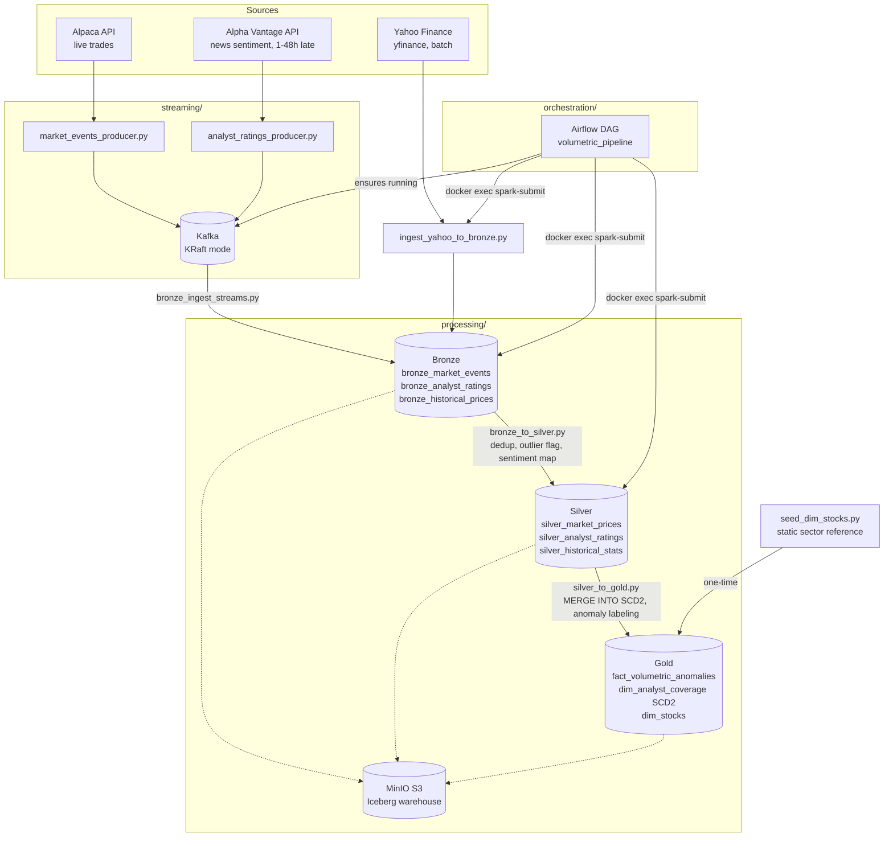

# Architecture

Medallion architecture (bronze/silver/gold) on Iceberg + MinIO, fed by one
streaming source (Kafka), one deliberately-late streaming source (Kafka), and
one batch source (Yahoo Finance). Airflow schedules the batch ETL chain and
keeps the streaming ingestion job alive.



The same diagram as a static image, for slides or anywhere Mermaid doesn't
render: [architecture_diagram.png](architecture_diagram.png). It's generated
from the block above, so regenerate it if that block changes:

```bash
npx @mermaid-js/mermaid-cli -i docs/architecture.md -o docs/architecture_diagram.png -t neutral -b white -s 4
```

## Layer responsibilities

- **Bronze**: raw, as-landed data with `ingestion_timestamp` appended. No
  cleaning, no joins — the source of truth in its original shape.
- **Silver**: deduped, outlier-flagged, sentiment mapped to a numeric score,
  and the 10-day rolling stats (volume ratio, volatility, RSI) computed once
  here so gold doesn't recompute them per query.
- **Gold**: three tables. `fact_volumetric_anomalies` answers the project's
  business question directly — every row is a day where volume exceeded 2x the
  10-day average, joined to the analyst sentiment that was actually active on
  that date, labeled with whether price moved ±5% over the following 5 trading
  days. `dim_analyst_coverage` is a proper SCD Type 2 dimension (history of
  sentiment changes per ticker, not just the latest value), and the fact table
  joins to it *temporally*, matching each anomaly against the version in effect
  on that date. `dim_stocks` is a small static dimension (30 tickers, 7
  sectors) seeded once by `seed_dim_stocks.py`; it wasn't in the mid-semester
  model, and exists because the dashboard's sector heatmap needs a sector per
  ticker that nothing else in the pipeline provides.

  Note the difference in write strategy: `dim_analyst_coverage` accumulates via
  MERGE INTO because history is the point of an SCD2, while the other two are
  recomputed from scratch each run — a fact table derived purely from
  historical data gives the same answer every time, so there's nothing to
  preserve. See [data_model.md](data_model.md) for the full schema.

## Why batch, not continuous streaming, for bronze→silver→gold

Only `bronze_ingest_streams.py` (Kafka → bronze) is a genuinely continuous
Structured Streaming job. `bronze_to_silver.py` and `silver_to_gold.py` are
batch jobs scheduled by Airflow every 15 minutes. See the design note at the
top of [`processing/jobs/bronze_to_silver.py`](../processing/jobs/bronze_to_silver.py)
for why: reading an Iceberg table as a streaming *source* ties the
checkpoint to the table's S3 FileIO in a way this image's dependencies can't
reconcile with Spark's generic checkpoint mechanism. MERGE INTO by natural
key gets the same idempotent, late-data-safe result without that dependency,
and matches the project spec's own split between "Stream Processing" (Kafka
ingestion) and "Batch Processing" (the ETL chain).

## Late-arrival handling

`analyst_ratings_producer.py` holds each rating for a genuine 1-48h delay
before publishing (not just a stamped field — see
[docs/streaming_interface.md](streaming_interface.md)). Because
`bronze_to_silver.py` and `silver_to_gold.py` are idempotent (MERGE INTO by
key), a rating that only becomes visible in bronze on a later scheduled run
is simply picked up then — no data is lost or double-counted regardless of
how late it arrives.
