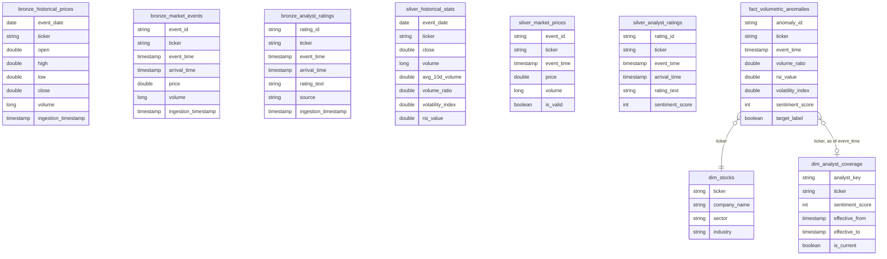

# Data Model

## Gold layer notes

`fact_volumetric_anomalies` is the star schema's fact table. One row per day
where a ticker's volume exceeded 2x its 10-day average, labeled with whether
the price then moved +-5% within 5 trading days.

`dim_analyst_coverage` is a **Type 2 slowly changing dimension**. A ticker
appears once per sentiment change, each version bounded by
`effective_from`/`effective_to`, with exactly one row per ticker carrying
`is_current = true`. The fact table joins to it *temporally* — matching each
anomaly against the version that was in effect on that date, not the current
one — which is what makes the history worth keeping. The join is a left join,
so `sentiment_score` is null for anomalies predating any analyst coverage.

`dim_stocks` is a static reference dimension (30 tickers, 7 sectors), loaded
once by `seed_dim_stocks.py`. It was not in the mid-semester model: the
sector heatmap panel needs a sector per ticker and nothing else in the
pipeline provides one, so it was added to support that.
